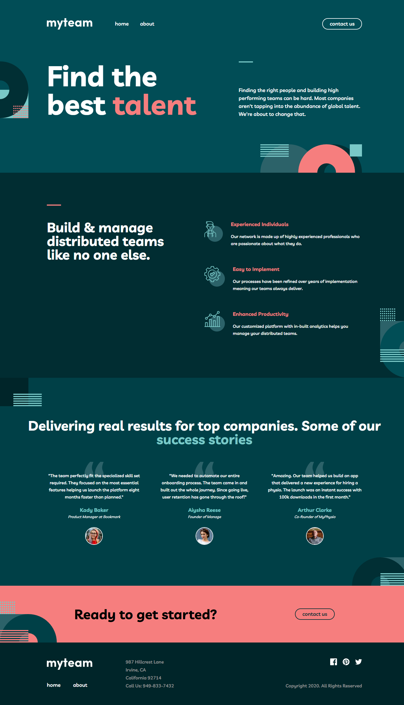

# Frontend Mentor - myteam multi-page website

This is a solution to the [myteam multi-page website](https://www.frontendmentor.io/challenges/myteam-multipage-website-mxlEauvW). Frontend Mentor challenges help you improve your coding skills by building realistic projects.

## Table of contents

- [Overview](#overview)
  - [The challenge](#the-challenge)
  - [Screenshot](#screenshot)
  - [Links](#links)
- [My process](#my-process)
  - [Built with](#built-with)
  - [What I learned](#what-i-learned)
  - [Useful resources](#useful-resources)
- [Author](#author)
- [Acknowledgments](#acknowledgments)

## Overview

### The challenge

Your challenge is to build out this multi-page website and get it looking as close to the design as possible.

You can use any tools you like to help you complete the challenge. So if you've got something you'd like to practice, feel free to give it a go.

Users should be able to:

- View the optimal layout for each page depending on their device's screen size
- See hover states for all interactive elements throughout the site
- See the correct content for each team member on the About page when the `+` icon is clicked
- Receive an error message when the contact form is submitted if:
  - The `Name`, `Email Address` or `Message` fields are empty should show "This field is required"
  - The `Email Address` is not formatted correctly should show "Please use a valid email address"

### Screenshot

### Links

- Solution URL: [https://github.com/artimys/myteam-multi-page](https://github.com/artimys/myteam-multi-page)
- Live Site URL: [https://myteam-multi-page-artimys.vercel.app](https://myteam-multi-page-artimys.vercel.app/)

## My process

### Built with

- [Next.JS](https://nextjs.org/)
- [Tailwind CSS](https://tailwindcss.com/)
- [Formik](https://formik.org/) - React Forms
- [Yup](https://github.com/jquense/yup) - Form Validation

### What I learned

TODO

### Useful resources

- [The Net Ninja - Tailwind CSS YouTube Playlist](https://www.youtube.com/playlist?list=PL4cUxeGkcC9gpXORlEHjc5bgnIi5HEGhw) - A list of videos that helped me get started with Tailwind CSS
- [Tailwind CSS Docs](https://tailwindcss.com/docs/installation) - Constantly hitting up the official Tailwind CSS documentation. It helped me figure out what class names where available and how to use them.
- [Tailwind CSS Cheat Sheet](https://nerdcave.com/tailwind-cheat-sheet) - A cheat sheet for Tailwind CSS. Found out about this after but could be useful for future projects.
- [Formik Tutorial with Yup Validation](https://www.youtube.com/watch?v=7Ophfq0lEAY&t=4s) - Great tutorial on how to get started with the libraries

## Author

- Frontend Mentor - [@artimys](https://www.frontendmentor.io/profile/artimys)

## Acknowledgments
